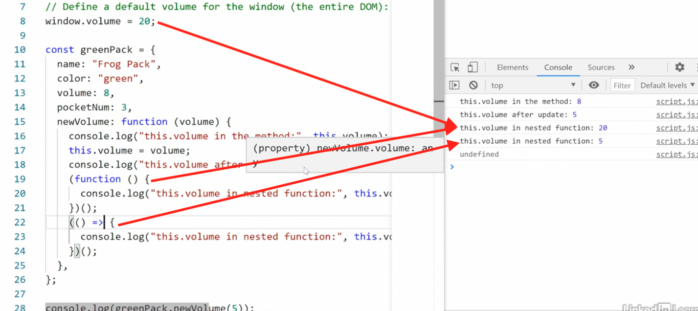

# Functions and Methods

There are couple form to creare a function.

**Function Declaration**
```js
function anyFunctionality(){}
```


**Function Expression**
```js
const anyFunctionality = function(){};
const anySecFunctionality = (param) => {};
```

Function expression is the best option because is inside a const, and it is locally scoped or block scoped. It also cannot be re-declared. So you're never in danger accidentally overwriting or destroying your function. 

**Immediately Invoked Function Expression (IIFE)**
(Anti-pattern)
(Also named Anonymous function)
(Arrow function is also named anonymous function)

```js
// This function is hoisted out of the object and up the global scope.
(function(){
    // Run any functionality, it does not need callback.
})();

// Or

const anonymousCallback = function (message) {
  console.log("Anonymous Callback: " + message);
};

```


## Important to see



## Internation Number Format With (Intl class)

The ```Intl.NumberFormat``` object enables leanguage-sensitive number formatting.

Source: https://developer.mozilla.org/en-US/docs/Web/JavaScript/Reference/Global_Objects/Intl/NumberFormat

```js

const formatter = (value, lang, currency) => {
    return (
        new Intl.NumberFormat(lang, {
            style: "currency",
            currency: currency
        }).format(value)
    );
}

let num = 896523.584;

console.log(`
    Your annually salary is: ${formatter(num, "en-US", "USD")}
`);

// Response: $896,523.58

```

## Callbacks
Is a function that is passed as an argument to another funtion. 

Traditional way of handling this

```js
// Callback in actions!!
const start = () => console.log("Starting Process");
const process = () => console.log("The process is running");
const done = () => console.log("The process is done");

const run = (s, p, d) => {
    s();
    p();
    d();
}

run(start, process, done);

```

## Callbacks with Promises

Using promises is a more modern and structured way to handle asynchronous operations and advoid callback hell. 

They have methods like ```then``` and ```catch``` to handle resolution or rejection of the promise.

```js
async function performAsyncOperation() {
    return new Promise((resolve, reject) => {
        setTimeout(() => {
            const success = true;
            
            if (success) {
                resolve("Operation completed successfully");
            } else {
                reject("Operation failed");
            }
        }, 1000);
    });
}

async function handleAsyncOperation() {
    try {
        const result = await performAsyncOperation();
        
        console.log("Async operation successful: " + result);
    } catch (error) {
        console.error("Async operation failed: " + error);
    }
}

// Using async/await
handleAsyncOperation();

```